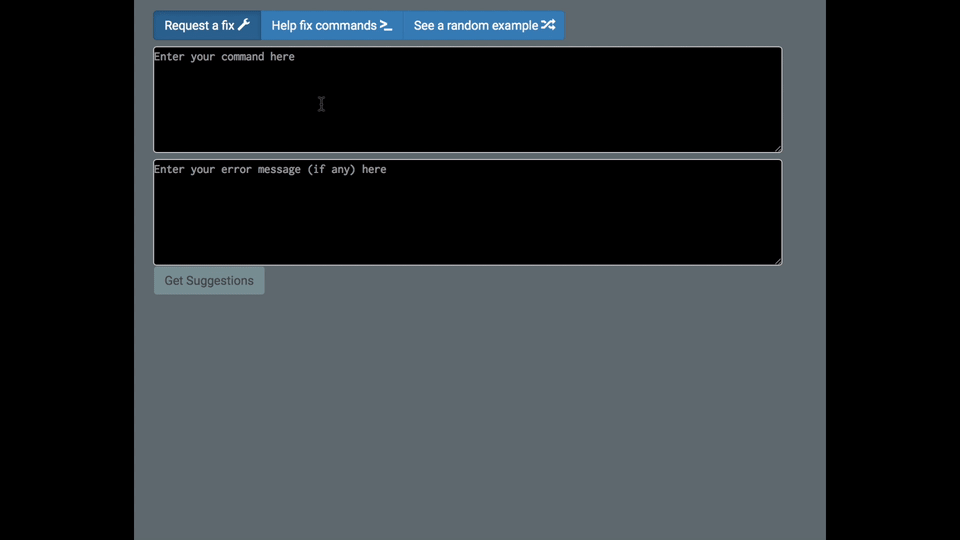
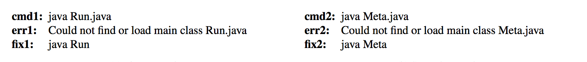

# How [NoFAQ](https://nofaq.cs.wisc.edu "NoFAQ") Works: A High-level Overview
[NoFAQ](https://nofaq.cs.wisc.edu "NoFAQ") is a web app which helps users fix broken command line commands. If a user runs a command, and obtains an error message, they can enter their incorrect command and error message into NoFAQ, and request a fixed version. NoFAQ will present any fixes it has learned to the user. If NoFAQ was not able to fix the command, it will use the request to learn how to work better in the future. 

Users can also help teach NoFAQ how to fix commands via the "Help Fix Commands" tab. NoFAQ will present previously unrepaired commands to the user, and she can suggest one or more fixes. If the command does not appear to be repairable, she can also inform NoFAQ of this fact. 

In addition, users can view random examples of programs which NoFAQ knows how to repair, to see example use cases, and to help curate rules and examples.



NoFAQ learns simple textual substitution programs which match and repair command line interactions. The domain-specific language we use to express NoFAQ rules is called FixIt. Despite providing a simple set of textual substitution operations, FixIt is still able to encode repair rules for a rich class of command line mistakes. 

A more technical version of this account, including an in-depth description of NoFAQ/FixIt, and mathematical proofs of various language properties can be found in our paper on [arXiv](https://arxiv.org/abs/1608.08219 "arXiv").

## The Structure of FixIt Rules
At the highest level, every FixIt rule has the structure 

```
if matching-predicate.evaluate(text, variable-set) then
   repair-function.apply(variable-set)
```
That is, if a piece of input text matches a certain set of criteria, we apply some repair logic to the text. To do this, we split a command and its corresponding error message into individual 'words', and test each word one by one against certain criteria. For example, we might check if the first word is "git", or we might check if some subsequent argument has the file extension ".java".

This matching logic also identifies certain important words in the input, and holds them for use by the repair function. On a successful match, the repair logic is able to manipulate whatever words the matching predicate selected. For example, we can retain a path like "/users/mike/home/program.py", and the repair function can decide to use "program.py" as part of its output, omitting the rest of the path. We can also alter the retained words, and do things like changing the file extension in "program.py" to "program.pyc".

While the repair function is able to use the input to generate output, the strings it yields are simple. Similar to how the input operates word-by-word, the output function prints a sequence of words, and glues them together using spaces. So we can learn operations like changing "java program.java" to "java program" or converting "apt-get install emacs" to "sudo apt-get install emacs".

### How does NoFAQ Learn FixIt Rules?
At the highest level, NoFAQ takes a set of consisting of incorrect commands, error messages, and repaired versions of commands, then identifies the differences between them, and tries to find a program that correctly converts each command/error pair to the corresponding repaired command. Since there are most likely many such programs, we choose the *most specific* one.



For example, by examining these two repair examples, NoFAQ identifies many points of commonality, namely the invoked commands, and the majority of the error message. In both cases, the user invokes java and passes in the name of a java file (with the appropriate extension). However, expecting a class name, the JVM outputs an error message saying it could not find a class with that name. 

In both cases, the class (per Java conventions) is simply the name of the file with the extension removed.

The rule we obtain will only execute if the user supplies a command of the form `java <name>.java`, as well as the error message `Could not find or load main class <name>.java`. If the input matches this criteria, we output `java <name>`.

When NoFAQ learns more complicated rules, it doesn't actually perform this logic over raw examples, as that would be inefficient. Instead, when it sees a new example, it does a "trial run" over the new input. Similar to how we identify differences between the two commands in the last example, NoFAQ identifies points where the existing rule doesn't quite work. At each of these points, we make the new rule just general enough to incorporate the new input, while ensuring that it doesn't break on previously seen examples.

Say we have a rule that maps command/error message pairs of the form

```
ls <directory>
ls: Permission denied.
```
to `sudo ls <directory>`. If, on a subsequent interaction, NoFAQ is given the repair example
```
cat /a/b/c
cat: Permission denied.
sudo cat /a/b/c
```
NoFAQ will generalize the existing rule to one that maps
```
<command> <directory>
<command>: Permission denied.
```
to `sudo <command> <directory>`

The learned rules have a very simple structure. Our java rule simply looks similar to this pseudo-code:
```
if CommandMatches( [Const("java"), VarWithSuffix(var-name="1", suffix=".java") ])
and ErrorMatches( [Const("Could"), Const("not") ...<constants>... VarWithSuffix(var-name="2", suffix=".java")])
then do MakeFix( [ Fix-Const("java"), Variable-Substring(var-name="1", from-start=0, from-end=-5) ])
```

For more details, you can see our paper [here](https://arxiv.org/abs/1608.08219 "arxiv").
